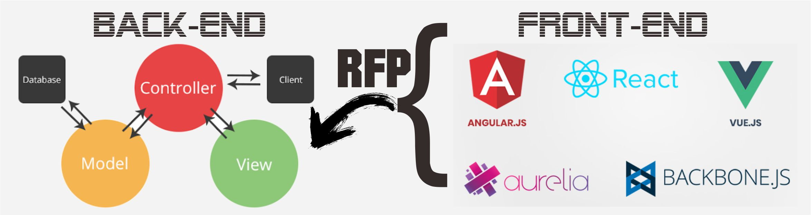

# NodeJS MVC with JS Framework 


---

[](https://www.youtube.com/user/jefripunza/videos/)
[](https://www.youtube.com/user/jefripunza/videos/)
<!-- [](https://www.youtube.com/user/jefripunza/videos/) -->
[](https://www.youtube.com/user/jefripunza/videos/)

## Donate

[](https://www.paypal.com/paypalme/jefripunza)

## Sosial Media

[](https://www.youtube.com/user/jefripunza/)
[](https://www.instagram.com/jefripunza/)
[](https://fb.com/jefripunza/)
[](https://twitter.com/jefripunza/)
[](https://www.linkedin.com/in/jefri-herdi-triyanto-ba76a8106/)
[](https://jefriherditriyanto.com/)


## Introduction
[](https://nodejs.org/)
[](https://expressjs.com/)
[](https://jwt.io/)


[](https://reactjs.org/)
[](https://vuejs.org/)
[](https://angular.io/)
[](https://svelte.dev/)
[](https://www.gatsbyjs.com/)
[](https://nextjs.org/)
[](https://nuxtjs.org/)
[](https://aurelia.io/)
[](https://jasmine.github.io/)
[](https://www.meteor.com/)
[](https://quasar.dev/)


[](https://www.w3schools.com/html/)
[](https://www.w3schools.com/css/)
[](https://www.javascript.com/)


MVC atau Model View Controller adalah sebuah pola desain arsitektur dalam sistem pengembangan website yang terdiri dari tiga bagian, yaitu:

- Model, bagian yang mengelola dan berhubungan langsung dengan database;
- View, bagian yang akan menyajikan tampilan informasi kepada pengguna;
- Controller, bagian yang menghubungkan model dan view dalam setiap proses request dari user.


Dengan konsep MVC ini, website seakan memiliki bagian yang terpisah dan bisa dikembangkan masing-masing. Maka, proses pembuatan website bisa dilakukan lebih cepat karena developer akan lebih fokus pada pengerjaan salah satu bagian saja.
Karena dianggap efektif, konsep MVC banyak diterapkan di berbagai framework.

Ditambah dengan metode frontend development yang saya buat sendiri dengan nama (RFP) **Remote Frontend Package**, yaitu dengan mengarsipkan semua hasil build dan file archive-nya (zip) dikirim ke pihak backend agar isi file archive di ekstrak ke dalam folder **js-framework** untuk ditampilkan ke publik.

Melihat dari beberapa kelebihan dari MVC dan metode yang saya buat, maka saya membuat repositori ini agar saya dan kawan-kawan bisa merasakan bagaimana menggunakan konsep MVC dan RFP di NodeJS.
Mudah-mudahan bermanfaat...

---

<br />
<b></b>


## Preparation

##### clone template
```bash
git clone https://github.com/jefripunza/nodejs-mvc-with-js-framework my-project-name
```

lalu pada folder **forFrontEnd**, copy file **sendToBackend.js** kemudian paste-kan **kedalam project frontend anda** dan **install dependensi** yang diperlukan : 
```bash
npm -i -D archiver axios
```


<br />

---
<br />


## How to USE

### first setup

buat file **.env** kedalam project dengan variabel sebagai berikut :
##### .env
```text
FE_PASSWORD=<your secret password for RFP>

MONGODB_URL=

MYSQL_USER=
MYSQL_PASS=
MYSQL_NAME=

PG_HOST=
PG_USER=
PG_PASS=
PG_DATABASE=
PG_PORT=5432

TELEGRAM_TOKEN=<if you use telegram bot>
```

rubah **package.json** pada bagian build menjadi :
##### config.js
```json
// (default) build folder is "build"
{
    ...
    "scripts": {
        "build": "react-scripts build && node sendToBackend"
    },
    ...
}

// build folder is "dist"
{
    ...
    "scripts": {
        "build": "react-scripts build && node sendToBackend dist"
    },
    ...
}

// and so on, following your basic javascript framework build folder
```

untuk merubah konfigurasi dasar silahkan masuk kedalam :
##### config.js
```javascript
...
const app = {
    app_name: "NodeJS MVC with JS Framework",
    port: process.env.PORT || 5000,
    host: "0.0.0.0",
    local_ip,
}
...
```

untuk menginisial aplikasi yang ingin digunakan silahkan masuk kedalam :
##### server.js
```javascript
...
// Webserver
const {
    app,
    webserver,
} = require("./app/webserver")({
    remoteFrontendPackage: true,
    bodyParser: true,
    secure: true,
    public: true,
    debug: true,
})

// Web Socket
const io = require('./app/websocket')({
    app,
    webserver,
    debug: true,
})
...
```


<br />

---
<br />


## Support the project

Apakah kamu menyukai project ini? Please support saya dengan menekan subscribe di [Youtube Channel](https://www.youtube.com/user/jefripunza/videos/) saya...

<br />

## Donation Please

Butuh ngopi gans, kasih lah untuk biaya pengembangan agar mudah membeli alat dan buat makan <br />
[](https://www.paypal.com/paypalme/jefripunza)
